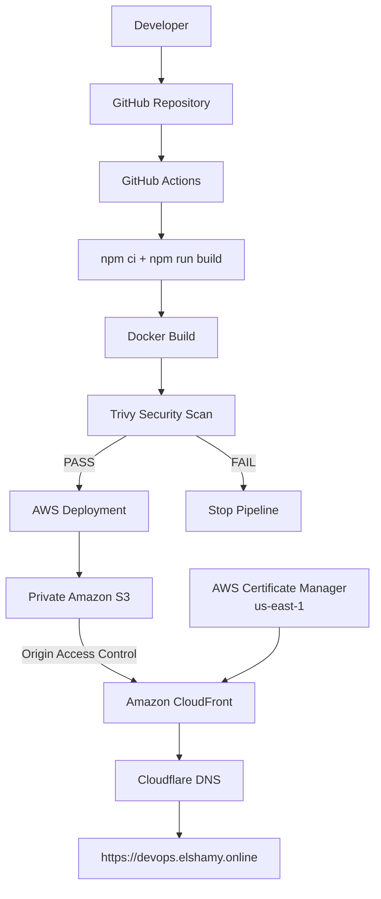
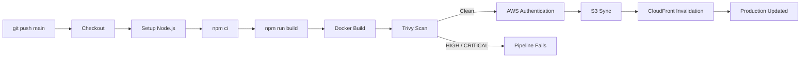
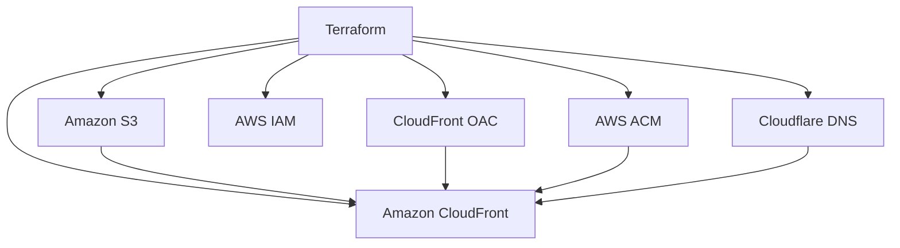
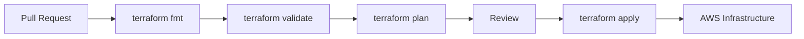
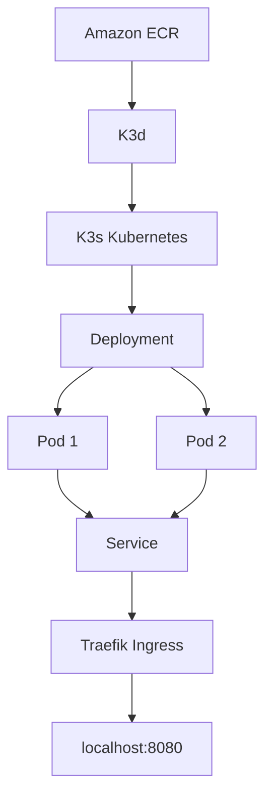
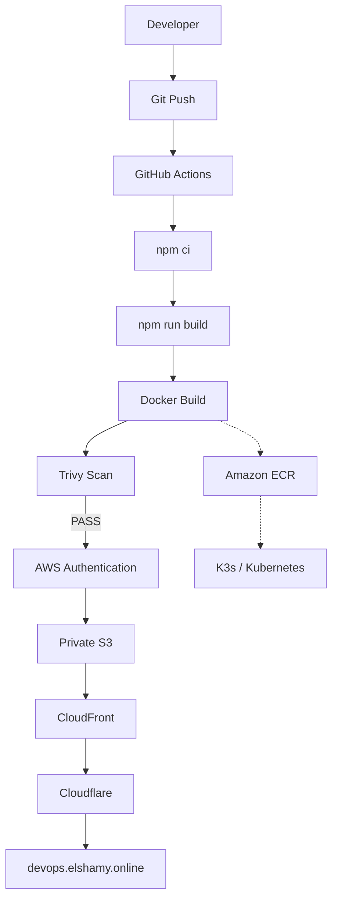

# 🚀 DevOps Hub — Cloud-Native DevOps Platform

<p align="center">
  <strong>A production-style DevOps portfolio platform demonstrating modern cloud, container, Kubernetes, security, and CI/CD practices.</strong>
</p>

<p align="center">
  <a href="https://devops.elshamy.online">🌐 Live Demo</a>
  ·
  <a href="https://github.com/EElshamy/devops-platform">📦 GitHub Repository</a>
</p>

---

## 📌 Project Overview

**DevOps Hub** is a React + Vite portfolio platform built as a practical end-to-end DevOps project.

The application is developed locally, containerized with Docker, security-scanned with Trivy, deployed to local K3d/K3s Kubernetes, and hosted in production using private Amazon S3 behind CloudFront.

### What this project demonstrates

- React + Vite application development
- Multi-stage Docker builds
- Nginx production runtime
- Container vulnerability scanning with Trivy
- Private Amazon S3 hosting through CloudFront
- CloudFront Origin Access Control (OAC)
- HTTPS with AWS Certificate Manager (ACM)
- Cloudflare DNS
- Amazon ECR
- K3d / K3s Kubernetes
- Kubernetes Deployment, Service, and Ingress
- GitHub Actions CI/CD
- Least-privilege IAM deployment permissions
- Automated S3 deployment
- Automated CloudFront cache invalidation

### 🌐 Live Demo

**https://devops.elshamy.online**

---

## 🔐 Security Notice

> The commands in this README are intended to be executed using
> the operator's own AWS and Kubernetes credentials.
>
> No AWS access keys, secrets, tokens, passwords, or private keys are
> stored in this repository.
>
> Never commit:
>
> - AWS Access Keys
> - AWS Secret Access Keys
> - GitHub Tokens
> - Kubernetes kubeconfig files
> - SSH Private Keys
> - `.env` files containing secrets
> - Terraform state files containing sensitive data

# 🏗️ Architecture

## Production Architecture



## Production request flow

```text
User
  │
  ▼
devops.elshamy.online
  │
  ▼
Cloudflare DNS
  │
  ▼
Amazon CloudFront
  │
  │ OAC
  ▼
Private Amazon S3
  │
  ▼
React static application
```

The S3 bucket is kept private. CloudFront accesses the bucket using **Origin Access Control (OAC)**.

---

# 🔄 CI/CD Pipeline

Every push to the `main` branch triggers the GitHub Actions workflow.



### Pipeline stages

| Stage | Purpose |
|---|---|
| Checkout | Downloads the repository |
| Setup Node.js | Creates the Node.js build environment |
| `npm ci` | Installs locked dependencies |
| `npm run build` | Generates the production React build |
| Docker Build | Builds the production Nginx image |
| Trivy | Scans the final container image |
| AWS Authentication | Configures AWS credentials |
| S3 Sync | Uploads `dist/` to the private S3 bucket |
| CloudFront Invalidation | Removes stale cached content |

The workflow is:

```text
.github/workflows/ci.yml
```

Deployment steps run only for pushes to `main`:

```yaml
if: github.event_name == 'push' && github.ref == 'refs/heads/main'
```

This keeps AWS deployment credentials out of pull-request execution.

---

# 🔐 CI/CD Security

The current deployment uses a dedicated IAM user:

```text
github-actions-deploy
```

The IAM policy is scoped to the project resources.

### S3 permissions

```text
s3:ListBucket
s3:GetObject
s3:PutObject
s3:DeleteObject
```

### CloudFront permission

```text
cloudfront:CreateInvalidation
```

The GitHub repository stores deployment values as repository secrets:

```text
AWS_ACCESS_KEY_ID
AWS_SECRET_ACCESS_KEY
AWS_REGION
S3_BUCKET
CLOUDFRONT_DISTRIBUTION_ID
```

No AWS credentials are stored in the repository.

> **Future hardening:** replace the long-lived IAM access key approach with GitHub Actions OIDC and an IAM role.

---

# 🛡️ Container Security with Trivy

Trivy is used as a security gate before deployment.

The workflow scans:

```text
HIGH
CRITICAL
```

and fails the pipeline when a qualifying vulnerability is found:

```yaml
severity: CRITICAL,HIGH
exit-code: 1
ignore-unfixed: true
```

## Real vulnerability remediation

During development, the initial container image contained HIGH vulnerabilities in Alpine `libuuid/util-linux`.

The findings were not suppressed.

Instead:

```text
Vulnerability detected
        ↓
Investigate affected package
        ↓
Update base image/packages
        ↓
Rebuild image
        ↓
Run Trivy again
        ↓
Clean result
        ↓
Deployment allowed
```

The final image was locally scanned with:

```bash
trivy image \
  --severity HIGH,CRITICAL \
  devops-platform:security-test
```

The resulting report showed:

```text
Vulnerabilities 0
```

This demonstrates a real security remediation workflow rather than simply ignoring scanner findings.

---


# 🏗️ Infrastructure as Code — Terraform

The infrastructure layer is designed around **Terraform** to provide a version-controlled, reproducible, and maintainable Infrastructure as Code workflow.



## Terraform responsibilities

Terraform is used to define and manage the infrastructure components required by the platform:

| Resource | Purpose |
|---|---|
| Amazon S3 | Private storage for the React production build |
| CloudFront | CDN and public application delivery |
| CloudFront OAC | Secure CloudFront-to-S3 access |
| AWS IAM | Least-privilege infrastructure and deployment permissions |
| AWS ACM | HTTPS/TLS certificate |
| Cloudflare DNS | Public DNS configuration |

## Terraform workflow

```text
Terraform Configuration
        │
        ▼
terraform init
        │
        ▼
terraform fmt
        │
        ▼
terraform validate
        │
        ▼
terraform plan
        │
        ▼
Review Infrastructure Changes
        │
        ▼
terraform apply
        │
        ▼
AWS / Cloudflare Infrastructure
```

### Initialize Terraform

```bash
terraform init
```

### Format configuration

```bash
terraform fmt -recursive
```

### Validate configuration

```bash
terraform validate
```

### Review changes

```bash
terraform plan
```

### Apply infrastructure

```bash
terraform apply
```

## Infrastructure as Code benefits

Using Terraform provides:

- **Reproducibility** — infrastructure can be recreated from code.
- **Version control** — infrastructure changes are tracked through Git.
- **Consistency** — resources are defined declaratively.
- **Reviewability** — `terraform plan` shows changes before applying them.
- **Automation** — infrastructure can become part of the CI/CD lifecycle.
- **Maintainability** — cloud resources are documented as code.
- **Scalability** — the same patterns can be extended to additional environments.

## Terraform and existing infrastructure

The production environment contains existing AWS resources. Terraform should manage these resources through a controlled adoption workflow rather than blindly recreating them.

```text
Existing AWS Resources
        │
        ▼
Terraform Configuration
        │
        ▼
terraform import
        │
        ▼
Terraform State
        │
        ▼
terraform plan
        │
        ▼
Verify / Reconcile
        │
        ▼
Terraform-managed Infrastructure
```

This approach allows existing infrastructure to be brought under Terraform management while minimizing the risk of replacing working production resources.

> **Important:** Terraform state files and credentials must never be committed to the public repository.

Recommended `.gitignore` entries:

```gitignore
.terraform/
*.tfstate
*.tfstate.*
crash.log
.env
.env.*
*.pem
*.key
```

## Future Terraform automation

The next stage of the project is to connect Terraform validation to GitHub Actions:



This will extend the DevOps workflow from **application CI/CD** into **Infrastructure as Code automation**.

---

# 🐳 Docker

## Container architecture

```text
React Source
     │
     ▼
Node.js Build Stage
     │
     ├── npm ci
     └── npm run build
     │
     ▼
dist/
     │
     ▼
Nginx Runtime Stage
     │
     ▼
Port 80
```

The project uses a **multi-stage Docker build**.

Node.js is used during build time, while Nginx serves the final static application.

### Benefits

- Smaller runtime footprint
- No Node.js runtime required
- Development dependencies are not needed in production
- Clear separation between build and runtime
- Easier container security scanning

## Build

```bash
docker build -t devops-platform:local .
```

## Run

```bash
docker run -d \
  --name devops-platform-test \
  -p 8080:80 \
  devops-platform:local
```

Open:

```text
http://localhost:8080
```

---

# 🌐 Nginx SPA Routing

React Router uses client-side routes such as:

```text
/
/devops
/cloud
/kubernetes
/docker
/skills
```

A direct request to `/docker` would normally cause Nginx to look for a physical `/docker` file.

The project solves this using:

```nginx
location / {
    try_files $uri $uri/ /index.html;
}
```

Therefore:

```text
/docker
    ↓
Nginx
    ↓
No physical file
    ↓
/index.html
    ↓
React Router
    ↓
Docker page
```

Assets are handled separately:

```nginx
location /assets/ {
    try_files $uri =404;
}
```

---

# 📦 Amazon ECR

The project image is stored in a private Amazon ECR repository.

```text
Repository:
devops-platform

Region:
eu-central-1
```

Current image:

```text
528087308835.dkr.ecr.eu-central-1.amazonaws.com/devops-platform:1.0.1
```

## Authenticate

```bash
aws ecr get-login-password \
  --region eu-central-1 \
| docker login \
  --username AWS \
  --password-stdin \
  528087308835.dkr.ecr.eu-central-1.amazonaws.com
```

## Tag

```bash
docker tag devops-platform:1.0.1 \
  528087308835.dkr.ecr.eu-central-1.amazonaws.com/devops-platform:1.0.1
```

## Push

```bash
docker push \
  528087308835.dkr.ecr.eu-central-1.amazonaws.com/devops-platform:1.0.1
```

## Pull

```bash
docker pull \
  528087308835.dkr.ecr.eu-central-1.amazonaws.com/devops-platform:1.0.1
```

---

# ☸️ Kubernetes / K3s

The same application is deployed locally using **K3d + K3s**.



## Cluster creation

```bash
k3d cluster create devops-platform \
  --servers 1 \
  --agents 2 \
  --port "8080:80@loadbalancer"
```

The cluster contains:

```text
1 control-plane node
2 worker nodes
```

## Verify

```bash
k3d cluster list
```

```bash
kubectl get nodes
```

All nodes should show:

```text
Ready
```

---

# 📁 Kubernetes Resources

The manifests are stored under:

```text
k8s/
├── deployment.yaml
├── service.yaml
└── ingress.yaml
```

## Namespace

```bash
kubectl create namespace devops-platform
```

---

## Deployment

The application runs with two replicas:

```yaml
replicas: 2
```

The deployment also defines:

- CPU requests
- Memory requests
- CPU limits
- Memory limits
- Readiness probe
- Liveness probe
- ECR image pull secret

Check:

```bash
kubectl get deployment -n devops-platform
```

Expected:

```text
devops-platform   2/2   2   2
```

---

# 🔑 Private ECR Authentication in Kubernetes

Because ECR is private, Kubernetes needs credentials to pull the image.

Create the registry secret:

```bash
kubectl create secret docker-registry ecr-registry \
  --namespace devops-platform \
  --docker-server=528087308835.dkr.ecr.eu-central-1.amazonaws.com \
  --docker-username=AWS \
  --docker-password="$(aws ecr get-login-password --region eu-central-1)"
```

The Deployment references:

```yaml
imagePullSecrets:
  - name: ecr-registry
```

### Important

ECR authentication tokens are temporary.

This method is suitable for the local K3s lab. A long-running Kubernetes environment should use an automated registry authentication mechanism.

---

# 🌍 Kubernetes Service

The application is exposed through a Kubernetes Service:

```yaml
type: LoadBalancer
```

Check:

```bash
kubectl get svc -n devops-platform
```

K3d exposes the application through:

```text
http://localhost:8080
```

---

# 🚪 Kubernetes Ingress

K3s provides Traefik as the ingress controller.

The project uses:

```yaml
ingressClassName: traefik
```

Check:

```bash
kubectl get ingress -n devops-platform
```

Test:

```bash
curl -I http://localhost:8080
```

Test a React route:

```bash
curl -I http://localhost:8080/docker
```

Expected:

```text
HTTP/1.1 200 OK
```

---

# ☁️ AWS Production Infrastructure

## S3

Production static assets are deployed to:

```text
devops-platform-eslam-2026
```

Region:

```text
eu-central-1
```

The bucket is private.

### Manual deployment

Build:

```bash
npm run build
```

Deploy:

```bash
aws s3 sync dist/ \
  s3://devops-platform-eslam-2026/ \
  --delete
```

Verify:

```bash
aws s3 ls \
  s3://devops-platform-eslam-2026/
```

---

# 🚀 CloudFront

Production traffic is delivered through Amazon CloudFront.

Distribution domain:

```text
d2m4cwdyljzt2z.cloudfront.net
```

CloudFront provides:

- Global edge delivery
- HTTPS
- Caching
- Custom domain support
- Private S3 integration
- Cache invalidation

The CloudFront distribution uses:

```text
Origin Access Control (OAC)
```

to access the private S3 bucket.

---

# 🔒 HTTPS / ACM

Production domain:

```text
devops.elshamy.online
```

The ACM certificate covers:

```text
devops.elshamy.online
```

Certificate region:

```text
us-east-1
```

The certificate is attached to the CloudFront distribution as the custom SSL certificate.

---

# 🌐 Cloudflare

Cloudflare is used as the DNS layer.

The public record maps:

```text
devops.elshamy.online
        ↓
d2m4cwdyljzt2z.cloudfront.net
```

The final request path is:

```text
Browser
  ↓
Cloudflare DNS
  ↓
CloudFront
  ↓
Private S3
```

---

# 🔁 Complete End-to-End Flow



---

# 🧪 Local Development

## Requirements

Install:

- Node.js
- npm
- Git
- Docker
- kubectl
- k3d
- AWS CLI

Verify:

```bash
node --version
npm --version
git --version
docker --version
kubectl version --client
k3d version
aws --version
```

## Clone

```bash
git clone https://github.com/EElshamy/devops-platform.git
```

```bash
cd devops-platform
```

## Install dependencies

```bash
npm install
```

## Start development server

```bash
npm run dev
```

---

# 🐳 Docker Local Workflow

Build:

```bash
docker build -t devops-platform:local .
```

Run:

```bash
docker run -d \
  --name devops-platform-test \
  -p 8080:80 \
  devops-platform:local
```

Check:

```bash
curl -I http://localhost:8080
```

Test routes:

```text
http://localhost:8080/docker
http://localhost:8080/kubernetes
http://localhost:8080/cloud
http://localhost:8080/devops
http://localhost:8080/skills
```

Stop:

```bash
docker stop devops-platform-test
```

Remove:

```bash
docker rm devops-platform-test
```

---

# ☸️ Kubernetes Deployment Workflow

Check cluster:

```bash
k3d cluster list
```

Check namespace:

```bash
kubectl get namespace devops-platform
```

Apply manifests:

```bash
kubectl apply -f k8s/deployment.yaml
kubectl apply -f k8s/service.yaml
kubectl apply -f k8s/ingress.yaml
```

Check everything:

```bash
kubectl get all -n devops-platform
```

Check ingress:

```bash
kubectl get ingress -n devops-platform
```

Check pods:

```bash
kubectl get pods -n devops-platform -o wide
```

Check rollout:

```bash
kubectl rollout status deployment/devops-platform \
  -n devops-platform
```

---

# 🔎 Kubernetes Troubleshooting

## Pod status

```bash
kubectl get pods -n devops-platform
```

## Pod details

```bash
kubectl describe pod <pod-name> \
  -n devops-platform
```

## Logs

```bash
kubectl logs <pod-name> \
  -n devops-platform
```

## Deployment

```bash
kubectl get deployment \
  -n devops-platform
```

## Service

```bash
kubectl get svc \
  -n devops-platform
```

## Ingress

```bash
kubectl get ingress \
  -n devops-platform
```

## Restart deployment

```bash
kubectl rollout restart deployment/devops-platform \
  -n devops-platform
```

---

# 🧰 Useful AWS Commands

## Current AWS identity

```bash
aws sts get-caller-identity
```

## List buckets

```bash
aws s3 ls
```

## List production objects

```bash
aws s3 ls \
  s3://devops-platform-eslam-2026/
```

## Deploy static files

```bash
aws s3 sync dist/ \
  s3://devops-platform-eslam-2026/ \
  --delete
```

## CloudFront invalidation

```bash
aws cloudfront create-invalidation \
  --distribution-id "$CLOUDFRONT_DISTRIBUTION_ID" \
  --paths "/*"
```

## List distributions

```bash
aws cloudfront list-distributions
```

---

# 🧹 Git Workflow

Check changes:

```bash
git status
```

Review:

```bash
git diff
```

Stage:

```bash
git add .
```

Commit:

```bash
git commit -m "feat: update website"
```

Push:

```bash
git push origin main
```

A push to `main` triggers CI/CD automatically.

---

# 🧪 CI/CD Verification Test

A simple end-to-end test is to change the Home page.

For example:

```jsx
<span>Build. Automate. Deploy. 🚀</span>
```

Then:

```bash
git add src/pages/Home.jsx
git commit -m "test: verify production deployment"
git push
```

GitHub Actions should perform:

```text
Build
  ↓
Docker Build
  ↓
Trivy Scan
  ↓
AWS Authentication
  ↓
S3 Sync
  ↓
CloudFront Invalidation
  ↓
Live Website
```

Verify:

```text
https://devops.elshamy.online
```

---

# 🗂️ Project Structure

```text
devops-platform/
│
├── .github/
│   └── workflows/
│       └── ci.yml
│
├── k8s/
│   ├── deployment.yaml
│   ├── service.yaml
│   └── ingress.yaml
│
├── public/
│
├── src/
│   ├── components/
│   ├── layouts/
│   ├── pages/
│   │   ├── Home.jsx
│   │   ├── DevOps.jsx
│   │   ├── Cloud.jsx
│   │   ├── Kubernetes.jsx
│   │   ├── Docker.jsx
│   │   └── Skills.jsx
│   │
│   ├── App.jsx
│   ├── main.jsx
│   └── index.css
│
├── .dockerignore
├── Dockerfile
├── nginx.conf
├── package.json
├── package-lock.json
└── README.md
```

---

# 📸 Recommended Screenshots

For a professional GitHub presentation, add:

```text
docs/
└── images/
    ├── application-home.png
    ├── docker-page.png
    ├── github-actions.png
    ├── aws-s3.png
    ├── aws-cloudfront.png
    ├── kubernetes-pods.png
    └── kubernetes-ingress.png
```

Example:

```markdown

```

```markdown

```

```markdown

```

```markdown

```

---

# 📚 Technologies

| Category | Technologies |
|---|---|
| Frontend | React, Vite, React Router |
| Web Server | Nginx |
| Containers | Docker |
| Registry | Amazon ECR |
| Kubernetes | Kubernetes, K3s, K3d, Traefik |
| Cloud | AWS |
| Storage | Amazon S3 |
| CDN | Amazon CloudFront |
| Certificate | AWS ACM |
| DNS | Cloudflare |
| CI/CD | GitHub Actions |
| Infrastructure as Code | Terraform |
| Security | Trivy, IAM least privilege |
| Version Control | Git, GitHub |

---

# 🎯 DevOps Skills Demonstrated

### Cloud

- AWS S3
- CloudFront
- ECR
- IAM
- ACM
- OAC
- CDN architecture
- Private object storage

### Containers

- Docker
- Multi-stage builds
- Nginx
- Container image management
- Image security scanning

### Kubernetes

- Pods
- Deployments
- ReplicaSets
- Services
- LoadBalancer
- Ingress
- Traefik
- Readiness probes
- Liveness probes
- Resource requests and limits
- Private registry authentication
- K3s
- K3d

### CI/CD

- GitHub Actions
- Automated builds
- Docker builds
- Security gates
- AWS deployment
- S3 synchronization
- CloudFront invalidation

### Security

- Least-privilege IAM
- Private S3
- CloudFront OAC
- HTTPS
- ACM
- Trivy
- GitHub repository secrets

### Networking

- DNS
- CNAME
- Cloudflare
- CDN
- HTTPS
- TLS
- Nginx
- SPA routing

---

# 🧠 Engineering Decisions

## Why private S3?

The S3 bucket is not exposed as a public website endpoint.

Instead:

```text
CloudFront
    ↓
OAC
    ↓
Private S3
```

This reduces the attack surface and makes CloudFront the controlled public entry point.

## Why CloudFront?

CloudFront provides:

- Edge caching
- Global delivery
- HTTPS
- Custom domain support
- Private S3 integration

## Why Nginx?

Nginx is lightweight and well suited to serving the generated React static files.

```text
Node.js
   ↓
Build time only

Nginx
   ↓
Runtime
```

## Why K3s/K3d?

K3s and K3d provide a lightweight Kubernetes environment for local learning and validation without requiring a managed Kubernetes cluster.

## Why Trivy?

Security scanning is integrated into CI as a deployment gate:

```text
Build
  ↓
Scan
  ↓
Security Gate
  ↓
Deploy
```

---

# ⚠️ Troubleshooting

## Docker daemon is not running

```bash
docker info
```

Start Docker Desktop if required.

---

## Port 8080 is already in use

```bash
docker ps --format "table {{.Names}}\t{{.Ports}}"
```

Or:

```bash
lsof -i :8080
```

---

## Kubernetes ImagePullBackOff

Inspect the pod:

```bash
kubectl describe pod <pod-name> \
  -n devops-platform
```

If ECR authentication has expired, recreate the secret:

```bash
kubectl delete secret ecr-registry \
  -n devops-platform
```

Then:

```bash
kubectl create secret docker-registry ecr-registry \
  --namespace devops-platform \
  --docker-server=528087308835.dkr.ecr.eu-central-1.amazonaws.com \
  --docker-username=AWS \
  --docker-password="$(aws ecr get-login-password --region eu-central-1)"
```

Restart:

```bash
kubectl rollout restart deployment/devops-platform \
  -n devops-platform
```

---

## React route returns 404 in Docker

Verify `nginx.conf` contains:

```nginx
location / {
    try_files $uri $uri/ /index.html;
}
```

---

## CloudFront route returns AccessDenied

React routes such as:

```text
/docker
/kubernetes
/skills
```

are client-side routes and may not exist as physical S3 objects.

The CloudFront distribution therefore needs a custom error response that sends the request to:

```text
/index.html
```

with:

```text
HTTP response code: 200
```

The project uses the SPA fallback for this behavior.

---

## Website still shows old content

Create a CloudFront invalidation:

```bash
aws cloudfront create-invalidation \
  --distribution-id "$CLOUDFRONT_DISTRIBUTION_ID" \
  --paths "/*"
```

---

# 🔒 Git Security Checklist

Before pushing:

```bash
git status
```

Search for credentials:

```bash
git grep -n "AWS_ACCESS_KEY_ID" || true
git grep -n "AWS_SECRET_ACCESS_KEY" || true
git grep -n "AKIA" || true
```

Never commit:

```text
.env
.env.*
*.pem
*.key
AWS credentials
Terraform state
```

---

# 🛣️ Future Roadmap

The project is intentionally built in stages.

### Current

```text
React
  ↓
Docker
  ↓
Trivy
  ↓
ECR
  ↓
K3s / Kubernetes

and

GitHub Actions
  ↓
S3
  ↓
CloudFront
  ↓
Cloudflare
```

### Planned

```text
Terraform
    ↓
Infrastructure as Code
    ↓
Import existing AWS resources
    ↓
terraform plan
    ↓
terraform apply
```

Additional future improvements:

- Terraform-managed S3
- Terraform-managed CloudFront
- Terraform-managed IAM
- GitHub Actions OIDC
- Automated ECR publishing
- Separate staging and production
- Versioned deployments
- Rollback strategy
- Monitoring and alerting
- Automated notifications

---

# 🏆 Project Outcome

This project demonstrates a complete DevOps lifecycle:

```text
Develop
   ↓
Build
   ↓
Containerize
   ↓
Security Scan
   ↓
Store Image
   ↓
Deploy to Kubernetes
   ↓
Deploy Static Build to AWS
   ↓
Distribute with CloudFront
   ↓
Expose through Cloudflare
   ↓
Automate with GitHub Actions
```

The result is a practical DevOps portfolio project combining:

```text
Application
+
Containers
+
Security
+
Kubernetes
+
AWS
+
CI/CD
+
DNS/CDN
```

---

# 🌐 Links

### Live Demo

https://devops.elshamy.online

### GitHub Repository

https://github.com/EElshamy/devops-platform

---

# 👨‍💻 Author

**Eslam Adel Elshamy**

DevOps Engineer

```text
AWS
Docker
Kubernetes
K3s
GitHub Actions
Terraform
Linux
Nginx
Cloudflare
CI/CD
Security
Cloud Infrastructure
```

---

## ⭐ Project Status

```text
Application              ✅
Docker                   ✅
Trivy Security           ✅
Amazon ECR               ✅
K3d / K3s                ✅
Kubernetes               ✅
S3                       ✅
CloudFront               ✅
ACM / HTTPS              ✅
Cloudflare DNS           ✅
GitHub Actions CI        ✅
GitHub Actions CD        ✅
Production Deployment    ✅
Terraform                🔜
OIDC                     🔜
```
